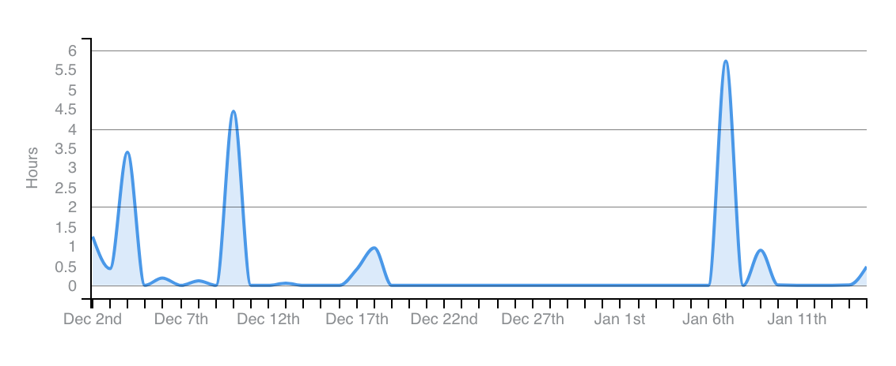

# Sudoku-Core
A C++ library for generating, validating, solving, checking, etc Sudoku puzzle. 

# Time
From 23 November 2022 to Jan 10 2023, Around 18 hours in Total

# What I learn ?

My first object-oriented programming project using the C++ programming language. This project introduces me to basic concepts of threading, providing me with my first experience working with a slightly larger codebase.

## First time
- use cmake build system
- use external library sqlite3 , google benchmark , google test(did not use it propertly)
- use threading in C++

## Area of improvement
- [x] virtual function is actually a virtual pointer pointing to the vtable which will slow down the program, any class with at least 1 pure virtual function is a abstract class which cannot be declared as an object in c++
- [x] Access level of `private` vs `public` vs `protected`
- [x] `using namespace std` should be avoided as this is pulling unnecessary header to the program
- [x] config should be store in a config/ OOP member but not using preprocessor to avoid generate different binaries
- [ ] Unit test is not proper
- [ ] OOP should be use for further development and 
- [ ] Avoid hardcode syntax e.g. sql statement

## How to improve in next project
- [ ] Plan out testing before start developing process
- [ ] Plan out OOp structure before start developing process

## Further stuff to learn
- [ ] Benchmark with threading
- [ ] unique_lock vs scoped_lock vs lock_guard
- [ ] how does concurrency work in the perspective of operating system? 
- [ ] how does concurrency work in the perspective of computer system? 
## Difficulties
I faced a difficult when I am designing the backtracking algorithm when generating a sudoku.
## How I overcome 
I asked in the community for feedback, and gratefully there are mentor willing to provide some guidiance.


# Installation 
Build the project: 
```
mkdir build
cd build
cmake ..
make
//run the generator brenchmark
./sudokugenerator
//run the test
sudokugenerator_test
```

Rebuild the project
```
cd build
make clean
make
```


# Algorithm to generate a sudoku 
This algorithm is referenced and further improved from [101 computing](https://www.101computing.net/sudoku-generator-algorithm/), which the original implementation does not guarantee the sudoku had only 1 unique solution.

**bool Sudoku::GenerateSudoku()**  
generate a sudoku board with all number filled. The board will be a completed board without any blank to filled.
```cpp
bool Sudoku::GenerateSudoku()
{
	vector<int> numbers(9);

	while (isComplete() == false)
	{
		for (int row = 0; row < 9; row++)
		{

			for (int col = 0; col < 9; col++)
			{

				if (board[row][col] == 0)
				{
					// fills out the numbers vector with numbers from 1 -> numbers.size()
					iota(begin(numbers), end(numbers), 1);
					SHUFFLE(numbers);
					for (int number : numbers)
					{
						if (isPlacable(row, col, number)) // if it is valid to place a number at the location.
						{ 
							board[row][col] = number;
							if (Sudoku::GenerateSudoku())
                             //recursion function to call itself and place further number
								return true;
							board[row][col] = 0;
						}
					}
					return false;
				}
			}
		}
	}
	return true;
}
```
**int Sudoku::SudokuSolution()**
return the number of unique solution that this sudoku board has as an int. 

```cpp
int Sudoku::SudokuSolution()
{
	int ans = 0;
	vector<int> numbers(9);

	// fills out the numbers vector with numbers from 1 -> numbers.size()
	iota(begin(numbers), end(numbers), 1);
	for (int row = 0; row < 9; row++)
	{

		for (int col = 0; col < 9; col++)
		{
			if (board[row][col] == 0)
			{
				for (int number : numbers)
				{
					if (isPlacable(row, col, number)) // if it is valid to place a number at the location.
					{
						board[row][col] = number;

						if (isCorrect())
							ans++;
						else
                            //recursion function to call itself and place further number
							ans += Sudoku::SudokuSolution();

						board[row][col] = 0;
					}
				}
                //return number of solutions that this sudoku has
				return ans;
			}
		}
	}
	return 0;
}
```
**void Sudoku::initialize(int difficulty)** 

```cpp
void Sudoku::initialize(int difficulty)
{
	GenerateSudoku();
	vector<int> rowsCandidates = CANDIDATE_ARRAY;
	SHUFFLE(rowsCandidates);
	vector<int> colsCandidates = CANDIDATE_ARRAY;
	SHUFFLE(colsCandidates);
	pair<pair<int, int>, int> backup = {{rowsCandidates[0], colsCandidates[0]}, board[rowsCandidates[0]][colsCandidates[0]]};
    //backup store the value of the next attemp 
	board[rowsCandidates[0]][colsCandidates[0]] = 0;

	int attempt = 0;
    // with the more higher difficulty, the algorithm will try to get away more number from the board (if the board has less number provided, it is more difficult)
	while (attempt < difficulty)
	{
		rowsCandidates = CANDIDATE_ARRAY;
		SHUFFLE(rowsCandidates);

		colsCandidates = CANDIDATE_ARRAY;
		SHUFFLE(colsCandidates);

		backup = {{rowsCandidates[0], colsCandidates[0]}, board[rowsCandidates[0]][colsCandidates[0]]};
		board[rowsCandidates[0]][colsCandidates[0]] = 0;
		if (SudokuSolution() > 1)
		{
			board[backup.first.first][backup.first.second] = backup.second;
			attempt++;
		}
	}
};
```
# Special thanks

Speical thanks to めぐ in Leetcode Warrior community to provide help in fixing a bug when designing the algorithm of *SudokuSolution()* which return the number of unique solution that a sudoku board has.


